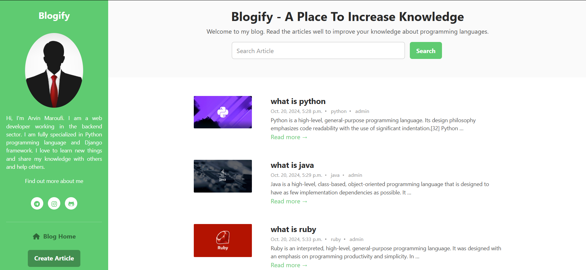

# 🌐 **پروژه وبلاگ `Blogify` با جنگو**



## 📋 توضیحات
این پروژه یک وبلاگ ساده است که با استفاده از فریمورک Django ساخته شده است. هدف این پروژه ارائه یک پلتفرم برای نوشتن و اشتراک‌گذاری مقالات با کاربران است.

## 🚀 ویژگی ها

* **ایجاد و ویرایش مقاله:** امکان ایجاد و ویرایش مقالات وبلاگ

* **ایجاد دسته بندی:** امکان ایجاد دسته بندی های وبلاگ

* **صفحه اصلی:** نمایش لیست مقالات

* **صفحه جزئیات:** نمایش جزئیات مقالات

* **جستجو:** قابلیت جستجوی مقالات بر اساس عنوان

## 🛠️ نصب و راه اندازی
برای نصب و راه‌اندازی این پروژه، مراحل زیر را دنبال کنید:

1. **کلون کردن مخزن:**

```bash
git clone https://github.com/arvinmaroufi/blogify.git
cd repo
```

2. **ایجاد محیط مجازی (اختیاری):**

```bash
python -m venv venv
source venv/bin/activate  # برای سیستم‌های Unix/Mac
venv\Scripts\activate  # برای ویندوز
```

3. **نصب وابستگی‌ها:**
   
```bash
pip install -r requirements.txt
```

4. **اجرای migrations:**

```bash
python manage.py migrate
```

5. **اجرای سرور:**

```bash
python manage.py runserver
```

6. **دسترسی به وب‌سایت:**
   در مرورگر خود به آدرس http://127.0.0.1:8000/ بروید.

## ✅ استفاده

پس از راه‌اندازی، می‌توانید مقالات رو مشاهده کنید و همینطور مقالات و دسته بندی های جدید ایجاد کنید.

## 🎯 مشارکت

اگر تمایل به مشارکت در این پروژه دارید، لطفاً مراحل زیر را دنبال کنید:

1. یک فورک از مخزن ایجاد کنید.
2. تغییرات خود را اعمال کنید.
3. یک Pull Request ارسال کنید.

## 🧾 مجوز

این پروژه تحت مجوز MIT منتشر شده است.

## 💻 نویسنده

**آروین معروفی** - [لینک پروفایل گیت‌هاب](https://github.com/arvinmaroufi)

## 💬 ارتباط با ما

اگر سوالی دارید یا نیاز به کمک بیشتری دارید، لطفاً با ما تماس بگیرید:

- **ایمیل**: [arvinmaroufi.dev@gmail.com](mailto:arvinmaroufi.dev@gmail.com)
- **گیت‌هاب**: [arvinmaroufi](https://github.com/arvinmaroufi/arvinmaroufi/issues)
- **اینستاگرام**: [arvinmaroufi.ir](https://instagram.com/arvinmaroufi.ir)
- **تلگرام**: [arvin_maroufi](https://t.me/arvin_maroufi)

ما خوشحال می‌شویم که از شما بشنویم 🙏

## ❤️ حمایت از ما

اگر از کار ما لذت می‌برید و می‌خواهید از ما حمایت کنید، لطفاً ما را در شبکه‌های اجتماعی دنبال کنید:

- **گیت‌هاب**: [arvinmaroufi](https://github.com/arvinmaroufi)
- **اینستاگرام**: [arvinmaroufi.ir](https://instagram.com/arvinmaroufi.ir)
- **تلگرام**: [arvinmaroufi_ir](https://t.me/arvinmaroufi_ir)

از حمایت شما سپاسگزاریم 🙏
